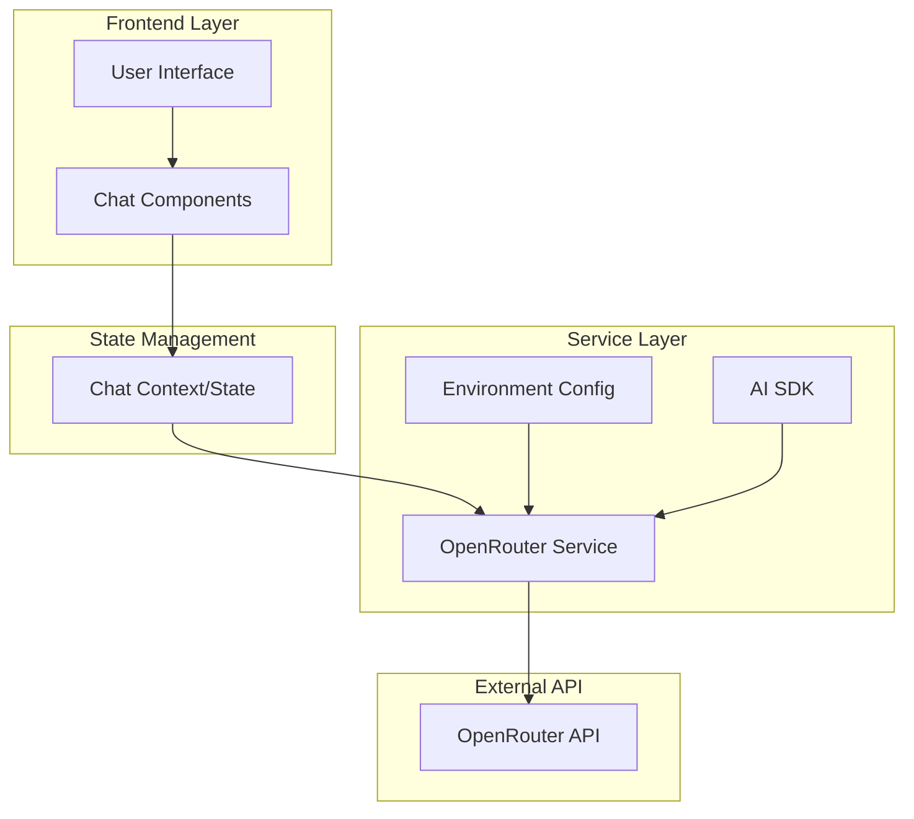

# Design Document

## Overview

This design integrates OpenRouter LLMs into the existing Next.js chat application. The application already has a solid foundation with React context for state management, TypeScript interfaces, and a component-based architecture. We'll extend this foundation by adding OpenRouter API integration using the AI SDK, implementing real AI responses to replace mock data, and enhancing the existing chat functionality.

The integration will leverage the `@openrouter/ai-sdk-provider` and `ai` packages to create streaming responses, maintain conversation context, and provide a seamless user experience with multiple model options.

## Architecture

### High-Level Architecture



### API Route Architecture

```mermaid
graph LR
    A[Client Request] --> B[/api/chat Route]
    B --> C[Request Validation]
    C --> D[OpenRouter Provider]
    D --> E[Stream Response]
    E --> F[Client Receives Stream]
```

## Components and Interfaces

### 1. API Route Handler (`/api/chat`)

**Purpose:** Handle chat requests and stream responses from OpenRouter
**Location:** `app/api/chat/route.ts`

**Interface:**
```typescript
// Request body
interface ChatRequest {
  messages: Message[];
  model: string;
}

// Response: Streaming text response using AI SDK
```

**Responsibilities:**
- Validate incoming requests
- Initialize OpenRouter provider with selected model
- Stream responses back to client
- Handle errors and rate limiting

### 2. OpenRouter Service Hook (`useOpenRouter`)

**Purpose:** Custom hook to manage OpenRouter interactions
**Location:** `lib/hooks/useOpenRouter.ts`

**Interface:**
```typescript
interface UseOpenRouterReturn {
  sendMessage: (content: string) => Promise<void>;
  isLoading: boolean;
  error: string | null;
  clearError: () => void;
}
```

**Responsibilities:**
- Manage API calls to `/api/chat`
- Handle streaming responses
- Update chat context with new messages
- Manage loading and error states

### 3. Enhanced Chat Context

**Purpose:** Extend existing context with OpenRouter integration
**Location:** `components/chat/ChatContext.tsx` (modifications)

**New Actions:**
```typescript
| { type: 'SET_LOADING'; payload: boolean }
| { type: 'SET_ERROR'; payload: string | null }
| { type: 'UPDATE_MODELS'; payload: Model[] }
```

**New State Properties:**
```typescript
interface ChatState {
  // ... existing properties
  isLoading: boolean;
  error: string | null;
  apiKeyConfigured: boolean;
}
```

### 4. Model Configuration

**Purpose:** Manage available OpenRouter models
**Location:** `lib/config/models.ts`

**Interface:**
```typescript
interface OpenRouterModel {
  id: string;
  name: string;
  description: string;
  contextLength: number;
  pricing: {
    prompt: number;
    completion: number;
  };
}
```

### 5. Enhanced Composer Component

**Purpose:** Extend existing composer with OpenRouter integration
**Location:** `components/chat/Composer.tsx` (modifications)

**New Features:**
- Integration with `useOpenRouter` hook
- Real-time streaming message display
- Enhanced error handling UI
- Loading states during API calls

## Data Models

### Message Model (Enhanced)

```typescript
interface Message {
  role: 'user' | 'assistant';
  content: string;
  timestamp: string;
  model?: string;
  id: string; // New: unique identifier
  streaming?: boolean; // New: indicates if message is being streamed
}
```

### Conversation Model (Enhanced)

```typescript
interface Conversation {
  id: string;
  title: string;
  model: string;
  messages: Message[];
  last_message_at: string;
  created_date: string;
  tokenCount?: number; // New: track token usage
}
```

### OpenRouter Configuration

```typescript
interface OpenRouterConfig {
  apiKey: string;
  baseUrl: string;
  defaultModel: string;
  maxTokens: number;
  temperature: number;
}
```

## Error Handling

### API Route Error Handling

1. **Authentication Errors**: Return 401 with clear message about API key configuration
2. **Rate Limiting**: Return 429 with retry-after header
3. **Model Unavailable**: Return 503 with fallback model suggestion
4. **Invalid Request**: Return 400 with validation error details
5. **Network Errors**: Return 500 with generic error message

### Client-Side Error Handling

1. **Network Failures**: Display retry button and offline indicator
2. **API Key Missing**: Show configuration instructions
3. **Model Errors**: Automatically fallback to default model
4. **Streaming Interruption**: Allow message retry
5. **Validation Errors**: Show inline form validation

### Error Recovery Strategies

- Automatic retry with exponential backoff
- Graceful degradation to cached responses
- Model fallback hierarchy
- Offline mode with local storage

## Testing Strategy

### Unit Tests

1. **OpenRouter Service Hook**
   - Test message sending functionality
   - Test error handling scenarios
   - Test loading state management
   - Mock API responses

2. **API Route Handler**
   - Test request validation
   - Test OpenRouter provider initialization
   - Test streaming response handling
   - Test error scenarios

3. **Enhanced Chat Context**
   - Test state updates with new actions
   - Test error state management
   - Test loading state transitions

### Integration Tests

1. **End-to-End Chat Flow**
   - Test complete message sending and receiving
   - Test model switching functionality
   - Test conversation persistence
   - Test error recovery

2. **API Integration**
   - Test actual OpenRouter API calls (with test API key)
   - Test streaming response handling
   - Test rate limiting behavior

### Component Tests

1. **Enhanced Composer**
   - Test message input and submission
   - Test loading states during API calls
   - Test error display and recovery
   - Test accessibility features

2. **Model Selector**
   - Test model selection functionality
   - Test model availability checking
   - Test fallback behavior

### Performance Tests

1. **Streaming Performance**
   - Test response time for different models
   - Test memory usage during long conversations
   - Test concurrent request handling

2. **State Management Performance**
   - Test context updates with large conversation histories
   - Test component re-render optimization

## Security Considerations

### API Key Management

- Store OpenRouter API key in environment variables only
- Never expose API key in client-side code
- Validate API key format before making requests
- Implement key rotation capability

### Request Validation

- Sanitize all user inputs before sending to OpenRouter
- Implement rate limiting per user/session
- Validate message content length and format
- Prevent injection attacks in prompts

### Response Handling

- Sanitize AI responses before displaying
- Implement content filtering for inappropriate responses
- Log security-relevant events
- Handle streaming interruptions securely

## Configuration

### Environment Variables

```bash
OPENROUTER_API_KEY=your_api_key_here
OPENROUTER_BASE_URL=https://openrouter.ai/api/v1
NEXT_PUBLIC_APP_NAME=NexasOSS
```

### Model Configuration

Default models will be loaded from a configuration file that can be updated without code changes. The configuration will include model availability, pricing information, and capability descriptions.

### Feature Flags

- `ENABLE_STREAMING`: Enable/disable streaming responses
- `ENABLE_MODEL_SWITCHING`: Allow users to change models
- `ENABLE_CONVERSATION_EXPORT`: Allow conversation export
- `DEBUG_MODE`: Enable additional logging and debugging features